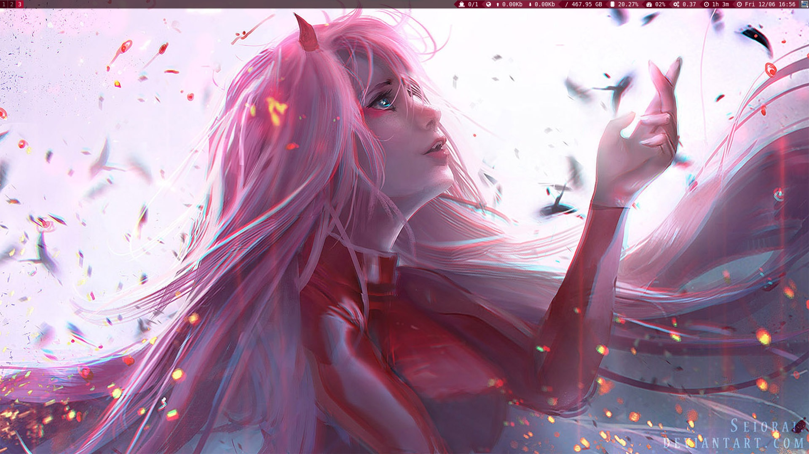
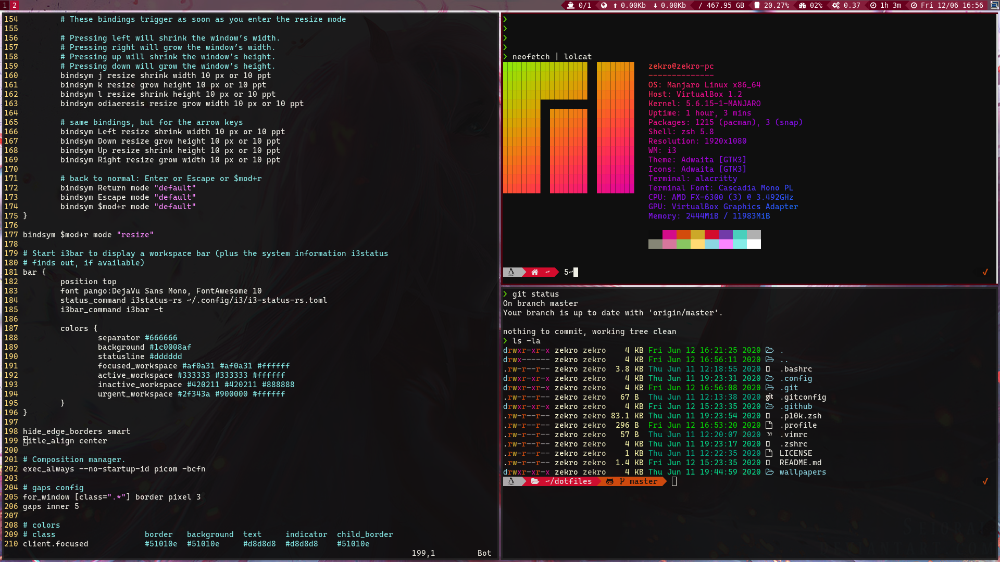
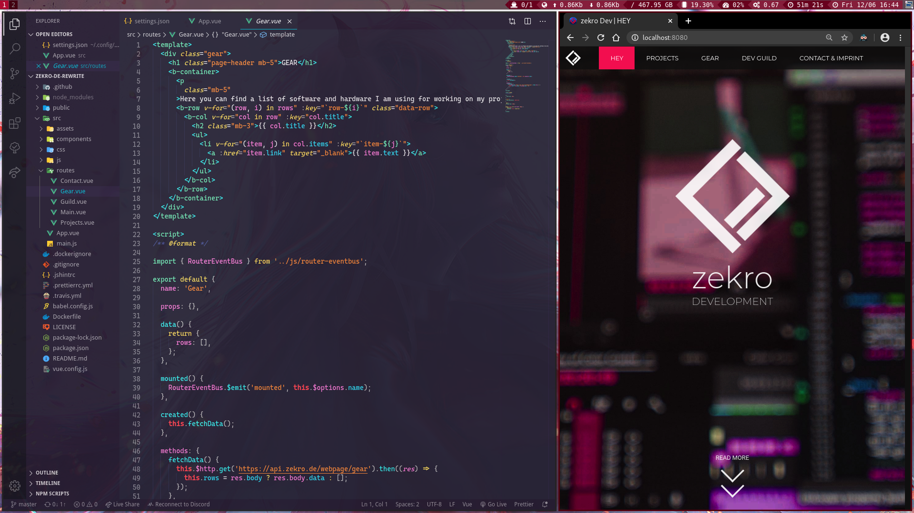

# .dotfiles

Small disclaimer: I'm a bit new into all this linux self customization stuff topic, so please excuse my noobieness. ^^  
Also big thanks to [@vbe0201](https://github.com/vbe0201/dotfiles) from whom I've copied some dotfiles and customized them for my needs.

These dotfiles are from my private development environemt and also some of my Linux development VMs at work.

## Screenshots

## Used Software and Packages

### Distro

Mostly I use [Manjaro](https://manjaro.org) on my client machines. I like the pre built environment and also having the advantages of Arch. Maybe later, I'll find the time to set up and get into Arch as well.

### Shell

- [Alacritty](https://github.com/alacritty/alacritty)
- [zsh](https://github.com/zsh-users/zsh)
- [Oh My Zsh](https://github.com/ohmyzsh/ohmyzsh)
- [Powerlevel10k](https://github.com/romkatv/powerlevel10k)

### Fonts

- [Cascadia Code](https://github.com/microsoft/cascadia-code)
- [Awesome Termonal Fonts](https://github.com/gabrielelana/awesome-terminal-fonts)

### Window Manager

- [i3-gaps](https://github.com/Airblader/i3)
- [picom](https://github.com/yshui/picom)
- [dmenu](https://tools.suckless.org/dmenu)
- [Nitrogen](https://github.com/l3ib/nitrogen)

### Etc

- [lsd](https://github.com/Peltoche/lsd)
- [Visual Studio Code](https://github.com/Microsoft/vscode)
- [Vim](https://www.vim.org/)

---
© 2020 Ringo Hoffmann (zekro Development)  
Covered by the MIT Licence.
